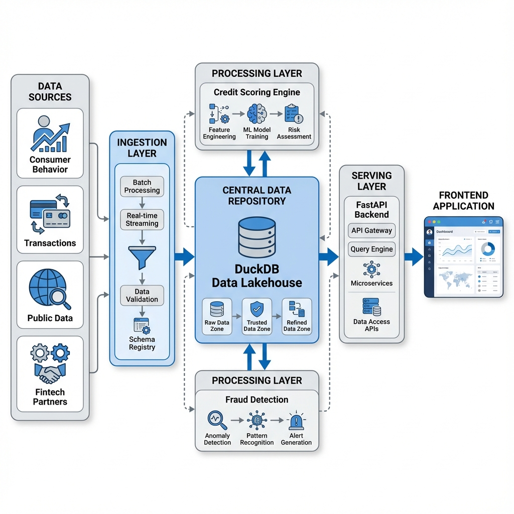

# Fintech DataOps Platform & Central Data Repository

## Overview
This project implements a high-level **DataOps Architecture** and **Central Data Repository** for a modern Fintech product. It serves as an intelligent engine that ingests raw data from multiple sources (Consumer Behavior, Transactions, Public Records, Fintech Partners), processes it to derive actionable insights (Credit Scores, Fraud Alerts), and exposes it via a real-time dashboard.

The system is built to demonstrate **DataOps principles**:
- **Continuous Ingestion**: Real-time data simulation and streaming.
- **Data Quality**: Automated checks and validation (Great Expectations style).
- **Observability**: Real-time monitoring of pipeline health and metrics.
- **Value Delivery**: Immediate transformation of raw data into business value (Credit Scores).



## Key Features
- **Central Data Repository**: Unified storage (DuckDB) anchoring all data processes.
- **Multi-Source Ingestion**: Simulates diverse data streams with realistic relationships.
- **Credit Scoring Engine**: Advanced logic combining behavioral, financial, and public data.
- **Fraud Detection Module**: Real-time rule-based engine for flagging suspicious activity.
- **DataOps Dashboard**: React-based UI for monitoring pipeline health and data quality.
- **Product View**: Customer 360 insights with score distribution and history.

## Technology Stack
- **Backend**: Python, FastAPI, APScheduler
- **Storage**: DuckDB (Data Lakehouse)
- **Processing**: Pandas (Simulating Spark/Stream Processing)
- **Frontend**: React, Vite, Recharts, Lucide React
- **DataOps**: Custom Observability & Quality Modules

## Getting Started

### Prerequisites
- Python 3.9+
- Node.js 16+

### Installation

1. **Clone the repository**
   ```bash
   git clone https://github.com/yourusername/fintech-dataops.git
   cd fintech-dataops
   ```

2. **Backend Setup**
   ```bash
   python3 -m venv venv
   source venv/bin/activate
   pip install -r backend/requirements.txt
   ```

3. **Frontend Setup**
   ```bash
   cd frontend
   npm install
   ```

### Running the Application

1. **Start the Backend**
   ```bash
   # From the root directory
   source venv/bin/activate
   export PYTHONPATH=$PYTHONPATH:$(pwd)
   uvicorn backend.main:app --host 0.0.0.0 --port 8000
   ```

2. **Start the Frontend**
   ```bash
   # From the frontend directory
   npm run dev
   ```

3. **Access the Dashboard**
   Open [http://localhost:5173](http://localhost:5173) in your browser.

## Documentation
- [System Architecture](docs/ARCHITECTURE.md)
- [DataOps Strategy](docs/DATAOPS_STRATEGY.md)

## Business Solution & Reporting
For a detailed analysis of the business problem, scope, and strategic solution provided by this platform, please refer to:
- **[Executive Business Report](docs/business_reports/EXECUTIVE_REPORT.md)**: A strategic analysis of the "Value Decay" problem and the DataOps solution.
- **[Strategic Presentation](docs/business_reports/STRATEGIC_PRESENTATION.md)**: A high-level deck summarizing the ROI and competitive advantage.

## Product Management
- **[Product Portfolio](docs/product_management/PRODUCT_PORTFOLIO.md)**: A Notion-style dashboard containing the Product Vision, OKRs, Roadmap, and KPIs.
- **[Public Product Portfolio (Notion)](https://daffy-leo-e93.notion.site/Fintech-DataOps-Platform-Public-Portfolio-2bdc1fd3d75b8069918fd9d6b7cac4c4?pvs=143)**: The live public product portfolio and roadmap.
