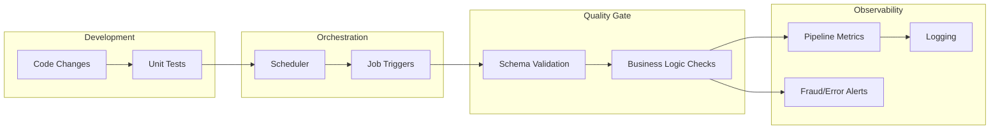

# System Architecture

## High-Level Architecture Diagram

This diagram illustrates the flow of data from raw sources through the ingestion and processing layers, ending in the serving layer and frontend application.

```mermaid
graph TD
    subgraph "Data Sources (Simulation)"
        CB[Consumer Behavior]
        TX[Transactions]
        PD[Public Data]
        FP[Fintech Partners]
    end

    subgraph "Ingestion Layer"
        IM[Ingestion Manager (APScheduler)]
        Kafka[(Simulated Stream/Kafka)]
    end

    subgraph "Central Data Repository"
        DL[(DuckDB Data Lakehouse)]
        Raw[Raw Tables]
        Derived[Derived Tables]
    end

    subgraph "Processing Layer"
        Scoring[Credit Scoring Engine]
        Fraud[Fraud Detection Module]
        DQ[Data Quality Checks]
    end

    subgraph "Serving Layer"
        API[FastAPI Backend]
    end

    subgraph "Frontend Application"
        Dash[DataOps Dashboard]
        Repo[Data Repository View]
        Product[Product/Insights View]
        FraudUI[Fraud Monitor]
    end

    CB --> IM
    TX --> IM
    PD --> IM
    FP --> IM

    IM --> Kafka
    Kafka --> Raw
    Raw --> DL

    DL --> Scoring
    DL --> Fraud
    DL --> DQ

    Scoring --> Derived
    Fraud --> Derived

    Derived --> API
    Raw --> API
    DQ --> API

    API --> Dash
    API --> Repo
    API --> Product
    API --> FraudUI
```

## DataOps Architecture

The DataOps architecture focuses on the operational aspects of the data pipeline: automation, quality, and observability.



## Component Details

### 1. Ingestion Layer
- **Technology**: Python Generators + APScheduler
- **Function**: Simulates high-velocity data streams.
- **Strategy**: Decouples data generation from storage to mimic real-world message queues.

### 2. Storage Layer
- **Technology**: DuckDB
- **Function**: Acts as a unified Data Lakehouse.
- **Strategy**: Stores both raw ingested data and processed/derived insights in a single, high-performance analytical store.

### 3. Processing Layer
- **Credit Scoring**: Aggregates user history, financial behavior, and public records to calculate a dynamic score (300-850).
- **Fraud Detection**: Analyzes transaction patterns in real-time to flag high-risk activities.
- **Data Quality**: Runs periodic checks on data freshness, schema validity, and business rule compliance.

### 4. Serving Layer
- **Technology**: FastAPI
- **Function**: Exposes RESTful endpoints for the frontend.
- **Strategy**: Provides a clean interface between the data layer and the user experience.
