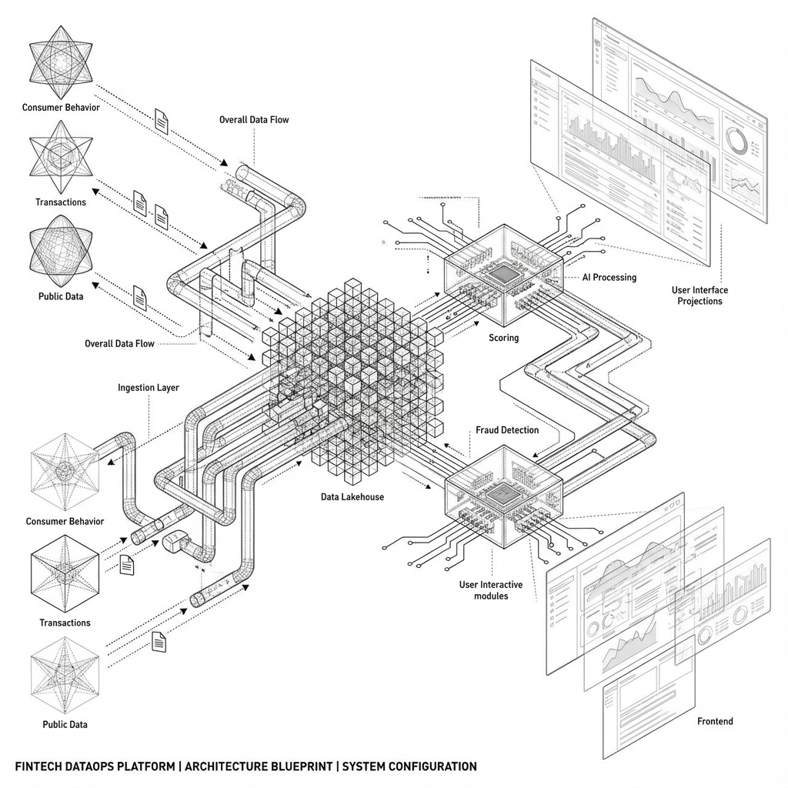

# System Architecture Diagram

This document illustrates the high-level system architecture of the Fintech DataOps Platform.

## Architecture Overview

The system is designed as a modern DataOps platform with the following key components:

1.  **Data Sources (Left)**:
    *   **Consumer Behavior**: Simulates user interactions and clickstreams.
    *   **Transactions**: Generates financial transaction data.
    *   **Public Data**: External data sources for enrichment.
    *   **Fintech Partners**: Third-party API integrations.

2.  **Ingestion Layer (Middle-Left)**:
    *   **Ingestion Manager**: Orchestrates the data flow.
    *   **Kafka (Simulated)**: Acts as the central message bus for streaming data.

3.  **Central Data Repository (Center)**:
    *   **DuckDB Data Lakehouse**: The core storage engine.
    *   **Raw Data**: Landing zone for ingested streams.
    *   **Derived Data**: Processed and enriched data tables.

4.  **Processing Layer (Surrounding Center)**:
    *   **Credit Scoring Engine**: Calculates dynamic credit scores.
    *   **Fraud Detection Module**: Identifies suspicious patterns in real-time.
    *   **Data Quality Checks**: Ensures data integrity and validity.

5.  **Serving & Frontend (Right)**:
    *   **FastAPI Backend**: Serves data via REST endpoints.
    *   **DataOps Dashboard**: Visualizes pipeline health and metrics.
    *   **Product Views**: User-facing applications for Credit Scores and Fraud Monitoring.

The diagram follows a "Hidden Blueprint" aesthetic, emphasizing the complex, interconnected nature of the data flows and the central role of the Data Repository.
