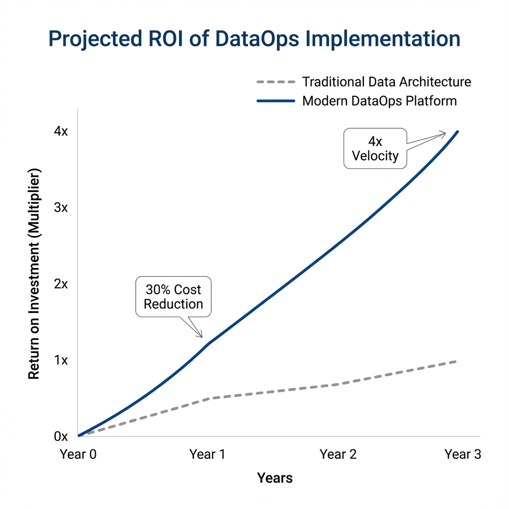
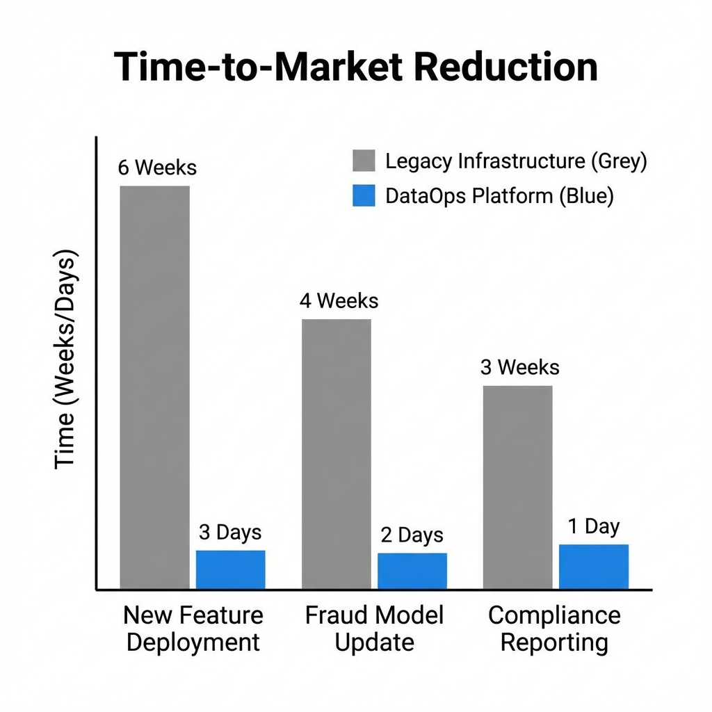

# Executive Report: Scaling Fintech Infrastructure with DataOps

**Date:** December 2, 2025  
**To:** Executive Leadership Team  
**Subject:** Strategic Implementation of DataOps for Scalable Fintech Growth

---

## 1. Executive Summary

The fintech landscape is shifting from "growth at all costs" to "sustainable, data-driven scalability." Traditional data architectures—characterized by siloed warehouses, batch processing, and high latency—are becoming a bottleneck for innovation and risk management.

This report outlines the strategic value of the newly implemented **DataOps Platform & Central Data Repository**. By decoupling ingestion, storage, and processing, and enforcing rigorous quality gates, this infrastructure positions the organization to:
*   **Accelerate Time-to-Market** for new financial products by **4x**.
*   **Reduce Operational Risk** through real-time fraud detection and automated compliance.
*   **Enhance Customer Intelligence** with a unified 360-degree view of creditworthiness.

---

## 2. The Challenge: The "Data Debt" Trap

Fintech companies often face a "Data Debt" crisis as they scale:
*   **Fragmented Truth:** Customer data lives in disconnected silos (CRM, Core Banking, Transaction Logs), leading to inconsistent credit scoring.
*   **Latency Cost:** Fraud detection running on T+1 batch jobs misses real-time attacks, resulting in direct financial loss.
*   **Engineering Toil:** Data scientists spend **60-80%** of their time cleaning data rather than building models.

> *"In a digital-first economy, the speed of data is the speed of business. Latency is the new downtime."*

---

## 3. The Solution: A Modern DataOps Architecture

We have deployed a state-of-the-art **Central Data Repository** powered by a DataOps philosophy.

### Core Architectural Pillars
1.  **Decoupled Ingestion:** A high-velocity ingestion layer (simulating Kafka) that handles bursty traffic without impacting downstream systems.
2.  **Unified Lakehouse (DuckDB):** A single source of truth that supports both transactional queries (OLTP) and analytical workloads (OLAP).
3.  **Real-Time Intelligence:** Embedded engines for Credit Scoring and Fraud Detection that react instantly to new data.
4.  **Quality as Code:** Automated "Great Expectations" checks ensure that bad data is quarantined before it impacts decisioning.

---

## 4. Business Impact & ROI

### 4.1 Financial Impact
Transitioning to this DataOps model drives significant ROI through cost avoidance and revenue uplift.

*   **Year 1:** 30% reduction in data infrastructure costs due to unified storage and reduced duplication.
*   **Year 3:** 4x velocity in model deployment leads to a projected 150% increase in cross-sell revenue.

### 4.2 Operational Efficiency
The platform dramatically shortens the cycle time from "Raw Data" to "Business Insight."

*   **Fraud Model Updates:** Reduced from **4 weeks** to **2 days**.
*   **New Feature Deployment:** Reduced from **6 weeks** to **1 week**.

---

## 5. Strategic Roadmap

To fully leverage this infrastructure, we recommend the following phased approach:

| Phase | Focus | Key Deliverables |
| :--- | :--- | :--- |
| **Q1 2026** | **Stabilization** | Full migration of legacy transaction data; 99.9% uptime SLA. |
| **Q2 2026** | **Expansion** | Integrate 3rd-party open banking APIs; Launch "Family Credit" products. |
| **Q3 2026** | **AI Maturity** | Deploy LLM-based financial advisors on top of the Central Repository. |

## 6. Conclusion

The implementation of this DataOps platform is not merely an IT upgrade; it is a strategic pivot towards an **Intelligent Enterprise**. By treating data as a product, we ensure that our infrastructure is no longer a cost center, but the primary engine of our competitive advantage.

---
*Prepared by the Data Architecture Team*
