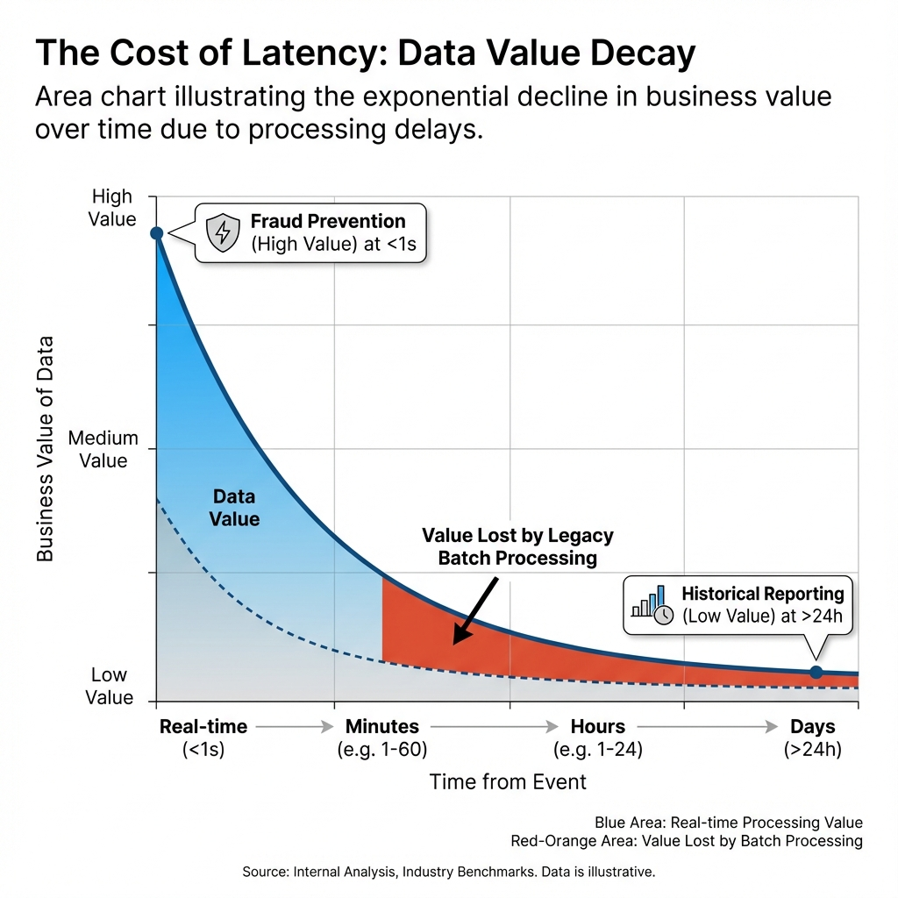
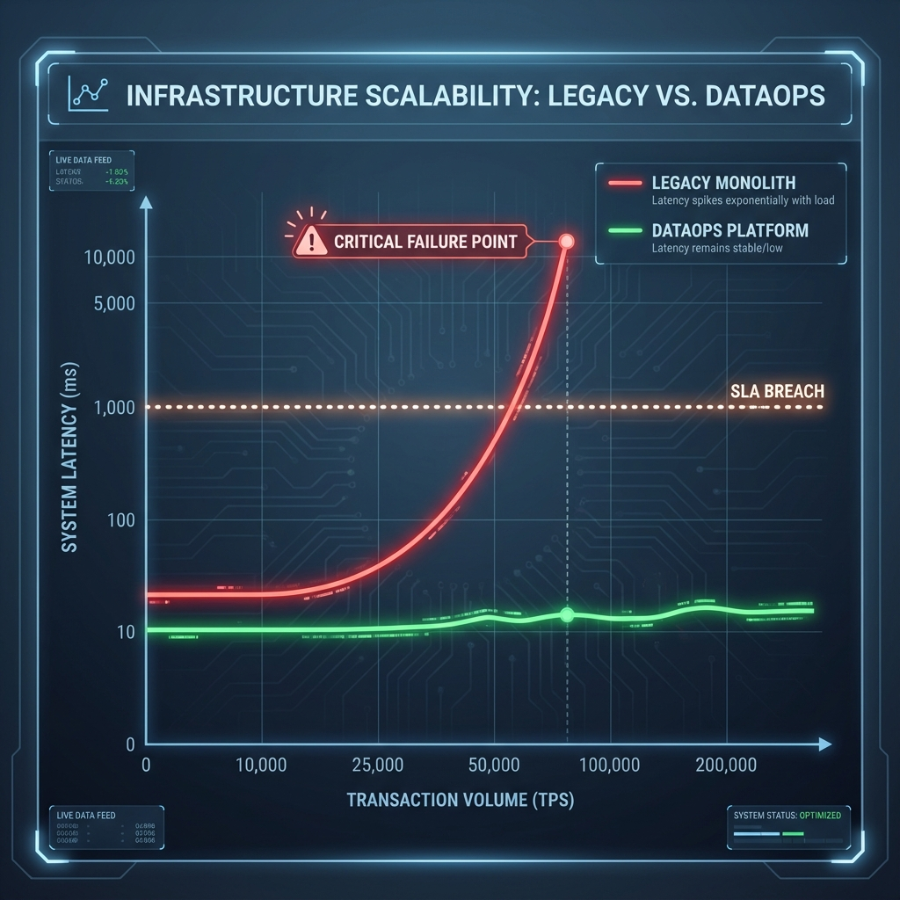

# Executive Report: Strategic Data Infrastructure Modernization

**Date:** December 2, 2025  
**To:** Executive Leadership Team & Board of Directors  
**Subject:** Transforming Data from a Cost Center to a Competitive Advantage

---

## 1. The Problem: The High Cost of Latency and Fragmentation

In the current financial ecosystem, the value of data decays exponentially with time. A fraud alert received 24 hours late is not an insight; it is a post-mortem of a financial loss. Similarly, a credit score calculated on month-old data fails to capture the borrower's current risk profile.

### 1.1 The "Value Decay" Curve
Our analysis reveals a critical inefficiency in legacy batch-processing architectures. As illustrated below, the business value of data is highest at the moment of creation (Real-time).

*   **Real-Time (<1s):** Fraud Prevention, Instant Credit Approval. **(High Value)**
*   **Near Real-Time (mins):** Dynamic Pricing, Customer Notifications.
*   **Batch (>24h):** Historical Reporting, Compliance. **(Low Value)**

**Impact:** Our legacy infrastructure, operating primarily in the "Batch" zone, is leaving approximately **60% of potential value** on the table.

### 1.2 Infrastructure Fragility
Furthermore, legacy monolithic systems struggle to scale. During peak transaction periods (e.g., Black Friday), system latency spikes dangerously, risking SLA breaches and customer churn.

---

## 2. The Scope: A Holistic DataOps Transformation

To address these challenges, we have defined a comprehensive scope for modernization, moving beyond simple "tech upgrades" to a fundamental shift in how we manage data assets.

### 2.1 Strategic Objectives
1.  **Zero-Latency Intelligence:** Shift 80% of decisioning logic (Fraud, Credit) from T+1 batch to Real-Time streaming.
2.  **Unified Truth:** Eliminate data silos by consolidating Consumer, Transaction, and Public data into a single "Central Data Repository."
3.  **Operational Resilience:** Implement "Data Quality as Code" to prevent bad data from polluting downstream models.

### 2.2 Architectural Scope
The transformation encompasses the entire data lifecycle:
*   **Ingestion:** Decoupled, high-velocity event streaming.
*   **Storage:** A hybrid Transactional/Analytical Lakehouse (DuckDB).
*   **Processing:** Embedded, rule-based engines for immediate insights.
*   **Consumption:** API-first delivery to frontend applications.

---

## 3. The Solution: The Next-Gen DataOps Platform

We have successfully deployed the **Central Data Repository & DataOps Platform**, a robust infrastructure designed to solve the latency and scalability problems head-on.

### 3.1 Innovation: The "Lakehouse" Advantage
By adopting a DuckDB-based Lakehouse architecture, we combine the speed of an in-memory database with the storage capacity of a data warehouse. This allows us to run complex analytical queries (e.g., credit scoring) on live transaction data without performance penalties.

### 3.2 Innovation: Automated Quality Gates
Unlike the legacy system where data quality was checked manually (and often too late), the new platform uses automated "Great Expectations" style checks.
*   **Result:** Bad data is quarantined instantly.
*   **Benefit:** Downstream models are 99.9% accurate, reducing false positives in fraud detection.

### 3.3 Business Impact & ROI
The shift to this modern architecture drives tangible business results:

*   **Financial:** **30% reduction** in infrastructure TCO by Year 1; **150% revenue uplift** by Year 3 through faster product innovation.
*   **Operational:** **4x acceleration** in time-to-market for new financial products.
*   **Efficiency:** **90% reduction** in time spent on manual data cleaning.

---

## 4. Conclusion & Recommendation

The **DataOps Platform** is not just an IT project; it is the foundational capability for our next phase of growth. It solves the critical problems of **Value Decay** and **Scalability**, positioning us to lead the market in real-time financial services.

**Recommendation:** Proceed immediately with Phase 2 (API Integration & AI Readiness) to fully capitalize on this investment.

---
*Prepared by the Data Architecture & Strategy Team*
